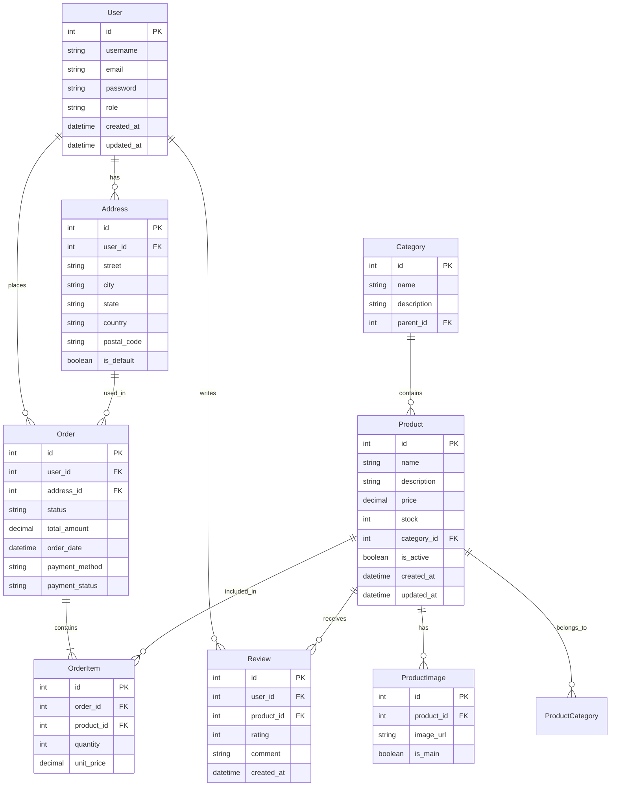

## Descripción de las Tablas

### User
- Almacena información de los usuarios del sistema
- Campos principales: id, username, email, password, role
- Relaciones: Orders, Addresses, Reviews

### Address
- Direcciones de envío de los usuarios
- Campos principales: id, user_id, street, city, state, country, postal_code
- Relaciones: User, Orders

### Order
- Pedidos realizados por los usuarios
- Campos principales: id, user_id, address_id, status, total_amount, order_date
- Relaciones: User, Address, OrderItems

### OrderItem
- Productos incluidos en cada pedido
- Campos principales: id, order_id, product_id, quantity, unit_price
- Relaciones: Order, Product

### Product
- Catálogo de productos de la tienda
- Campos principales: id, name, description, price, stock, category_id
- Relaciones: OrderItems, Reviews, ProductImages, Category

### Category
- Categorías de productos
- Campos principales: id, name, description, parent_id
- Relaciones: Products

### ProductImage
- Imágenes de los productos
- Campos principales: id, product_id, image_url, is_main
- Relaciones: Product

### Review
- Reseñas de productos por usuarios
- Campos principales: id, user_id, product_id, rating, comment
- Relaciones: User, Product 